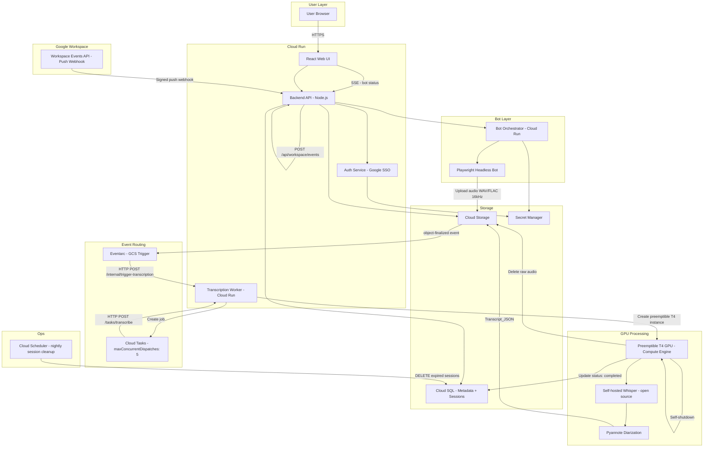
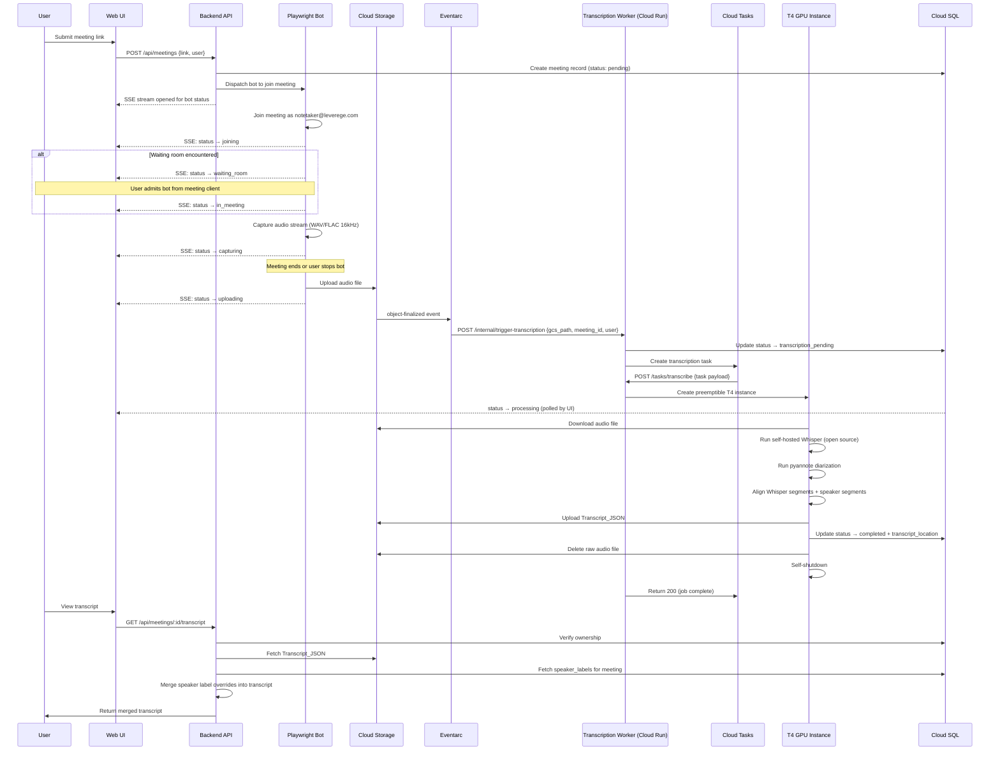
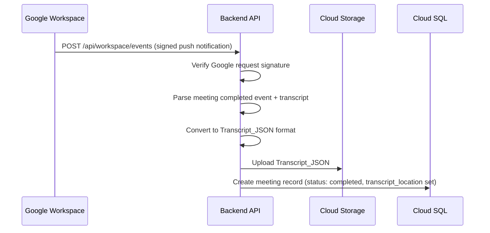

# Leverege Meeting Notetaker — Technical Design

## Overview

This document describes the technical design for the Leverege Meeting Notetaker system. The system captures audio from meetings (Google Meet, Zoom, Microsoft Teams), transcribes it with speaker attribution using self-hosted Whisper and pyannote on GCP, and presents transcripts through a React web UI.

Two capture strategies are employed:

1. **Playwright headless bot** — joins Zoom, Teams, and external Google Meet sessions as `notetaker@leverege.com`, captures audio via browser APIs, and uploads WAV/FLAC at 16kHz to Cloud Storage.
2. **Google Workspace Events API** — pulls transcripts directly from internal Google Meet sessions hosted within the Leverege organization, requiring no bot.

All processing stays within GCP. Audio never leaves the project boundary. No external APIs (including the OpenAI Whisper API) are used for transcription. The self-hosted Whisper open source model runs entirely on a preemptible T4 GPU instance within the GCP project.

### Key Design Decisions

| Decision | Rationale |
|----------|-----------|
| Playwright over Puppeteer | Playwright has first-class support for Chromium, Firefox, and WebKit — needed for Teams (Chromium-based) and Zoom (web client). Better multi-browser API. |
| Preemptible T4 GPU | ~70% cost savings vs on-demand. Acceptable because transcription is asynchronous and retryable. |
| Cloud Run (Transcription Worker) receives Cloud Tasks jobs | Cloud Run handles HTTP concerns (auth, TLS, retries, timeouts) serverlessly. It receives the Cloud Tasks delivery and manages the T4 instance lifecycle — cleaner separation than running a Flask server on the GPU instance itself. |
| Eventarc triggers Cloud Run on audio upload | Cloud Storage does not natively trigger Cloud Tasks. Eventarc listens for GCS object-finalized events and calls a Cloud Run endpoint, which creates the Cloud Tasks job. |
| T4 instance spins up per job, shuts down after | Instance only exists for the duration of processing (~13-18 min per meeting). No always-on GPU cost. |
| Cloud Tasks `maxConcurrentDispatches` enforces job limit | Built-in queue configuration enforces the max 5 concurrent jobs cap. No custom rate limiter needed. |
| Cloud Tasks over Pub/Sub | Cloud Tasks provides built-in retry, rate limiting, and deduplication. Better fit for job-queue semantics than Pub/Sub's event-streaming model. |
| Cloud SQL over Firestore | Relational schema fits meeting metadata well (joins for user scoping, status queries). Cloud SQL supports transactions for status updates. |
| WAV/FLAC at 16kHz | Whisper's native sample rate. Avoids resampling artifacts. FLAC preferred for bandwidth savings; WAV as fallback. |
| Transcript_JSON in Cloud Storage (not Cloud SQL) | Transcripts can be large. Cloud Storage is cheaper for blob storage and avoids Cloud SQL row-size limits. |
| Speaker labels in separate table | Keeps Transcript_JSON immutable. Overrides are merged at query time by the API, not written back to the file. |
| Audio deletion post-transcription | Minimizes sensitive data retention. Audio is only needed during the transcription pipeline. |
| Server-Sent Events (SSE) for bot status | Low-overhead unidirectional push from server to browser. Sufficient for waiting room notifications without WebSocket complexity. |
| Workspace Events webhook verification | Google signs push notification requests. Backend API verifies signature to prevent spoofing. |
| Session cleanup via Cloud Scheduler | Nightly job deletes expired sessions from Cloud SQL. Prevents unbounded table growth. |

## Architecture

### High-Level Architecture



### Request Flow — External Meeting (Bot Path)



### Request Flow — Internal Google Meet (Workspace Events API Path)



### GPU Instance Lifecycle

```
Cloud Tasks delivers job to Transcription Worker (Cloud Run)
    ↓
Transcription Worker calls Compute Engine API
    → Creates preemptible n1-standard-4 + T4 GPU instance
    → Passes startup script with: audio_gcs_path, meeting_id, owning_user
    ↓
Instance boots (~2-3 min cold start)
    → Downloads audio from Cloud Storage
    → Runs self-hosted Whisper (open source model weights, no external API call)
    → Runs pyannote diarization
    → Uploads Transcript_JSON to Cloud Storage
    → Updates Cloud SQL status → completed
    → Deletes raw audio from Cloud Storage
    → Calls `gcloud compute instances delete --self` (self-shutdown)
    ↓
Transcription Worker detects instance completion
    → Returns HTTP 200 to Cloud Tasks
```

**Cold start latency budget:**

| Step | Duration |
|------|----------|
| Meeting ends → audio upload | ~30s |
| Eventarc → Cloud Tasks creation | ~instant |
| Cloud Tasks → T4 instance spin-up | ~2-3 min |
| Whisper + pyannote (1hr meeting) | ~10-15 min |
| **Total: transcript available** | **~13-18 min after meeting ends** |

This latency is acceptable for an async notetaker. Users should not expect real-time transcripts.

## Components and Interfaces

### 1. Backend API (Cloud Run — Node.js)

The central API service handling all client requests, bot orchestration, and Workspace Events API integration.

**Endpoints:**

| Method | Path | Description | Auth |
|--------|------|-------------|------|
| POST | `/api/meetings` | Submit a meeting link for bot capture | Required |
| GET | `/api/meetings` | List meetings for authenticated user | Required |
| GET | `/api/meetings/:id` | Get meeting metadata | Required (owner only) |
| GET | `/api/meetings/:id/transcript` | Get Transcript_JSON with speaker label overrides merged | Required (owner only) |
| PATCH | `/api/meetings/:id/speakers` | Update speaker label mappings | Required (owner only) |
| GET | `/api/meetings/:id/status` | SSE stream — real-time bot and transcription status | Required (owner only) |
| POST | `/api/workspace/events` | Receive signed Google Workspace push notifications | Signature verified |
| POST | `/api/auth/callback` | Google SSO OAuth callback | Public |
| POST | `/api/auth/logout` | Invalidate session | Required |
| GET | `/api/auth/me` | Get current user info | Required |

> ⚠️ `/api/workspace/events` is public-facing but must verify the Google-signed request header before processing. Reject any request that fails signature verification with a 403.

**Middleware:**
- `authMiddleware` — validates session token, extracts user identity
- `ownershipMiddleware` — verifies authenticated user owns the requested meeting
- `rateLimitMiddleware` — prevents abuse of meeting submission endpoint
- `workspaceSignatureMiddleware` — verifies Google push notification signatures on `/api/workspace/events`

**Transcript merge behavior:** When serving `GET /api/meetings/:id/transcript`, the API SHALL:
1. Fetch the raw Transcript_JSON from Cloud Storage
2. Fetch all `speaker_labels` rows for the meeting from Cloud SQL
3. For each transcript entry, replace `speaker` with the `custom_label` if a mapping exists
4. Return the merged result — the raw Transcript_JSON in Cloud Storage is never modified

### 2. Transcription Worker (Cloud Run — Python)

A dedicated Cloud Run service that acts as the bridge between Cloud Tasks and the T4 GPU instance. Handles two endpoints:

```
POST /internal/trigger-transcription   ← called by Eventarc on audio upload
POST /tasks/transcribe                 ← called by Cloud Tasks to dispatch job
```

```python
class TranscriptionWorker:
    def trigger_transcription(self, gcs_path: str, meeting_id: str, owning_user: str) -> None:
        """
        Called by Eventarc when audio file lands in Cloud Storage.
        Creates a Cloud Tasks job. Updates meeting status to transcription_pending.
        """
        pass

    def handle_task(self, task: TranscriptionTask) -> None:
        """
        Called by Cloud Tasks. Creates a preemptible T4 Compute Engine instance
        with a startup script that runs the transcription pipeline.
        Polls for instance completion, then returns 200 to Cloud Tasks.
        """
        pass

    def create_gpu_instance(self, task: TranscriptionTask) -> str:
        """
        Creates a preemptible n1-standard-4 + T4 GPU instance via Compute Engine API.
        Injects task parameters as instance metadata (startup script reads them).
        Returns instance name.
        """
        pass
```

### 3. Auth Service (Google SSO)

Handles OAuth 2.0 / OpenID Connect flow with Google.

```typescript
interface AuthService {
  initiateLogin(redirectUri: string): string;
  handleCallback(code: string): Promise<Session>;
  validateSession(token: string): Promise<User | null>;
  logout(token: string): Promise<void>;
}

interface Session {
  token: string;
  user: User;
  expiresAt: Date;
}

interface User {
  email: string;
  name: string;
  picture?: string;
}
```

### 4. Bot Orchestrator (Cloud Run)

Manages Playwright bot lifecycle — spawning, monitoring, status streaming, and cleanup.

```typescript
interface BotOrchestrator {
  dispatchBot(meetingLink: string, meetingId: string, userId: string): Promise<BotSession>;
  getBotStatus(meetingId: string): Promise<BotStatus>;
  stopBot(meetingId: string): Promise<void>;
  // SSE stream — pushes status updates to the Backend API, which forwards to Web UI
  streamStatus(meetingId: string): AsyncIterable<BotStatus>;
}

interface BotSession {
  meetingId: string;
  status: 'joining' | 'waiting_room' | 'in_meeting' | 'capturing' | 'uploading' | 'completed' | 'failed';
  startedAt: Date;
  platform: 'google_meet' | 'zoom' | 'teams';
}

type BotStatus = {
  status: BotSession['status'];
  waitingRoomSince?: Date;
  error?: string;
};
```

### 5. Playwright Bot

The headless browser instance that joins meetings and captures audio.

```typescript
interface MeetingBot {
  join(meetingLink: string, credentials: PlatformCredentials): Promise<void>;
  startCapture(): Promise<void>;
  stopCapture(): Promise<AudioBuffer>;
  leave(): Promise<void>;
  getState(): BotState;
}

interface PlatformCredentials {
  platform: 'google_meet' | 'zoom' | 'teams';
  credentials: Record<string, string>; // fetched from Secret Manager at runtime
}

interface AudioBuffer {
  data: Buffer;
  format: 'wav' | 'flac';
  sampleRate: 16000;
  durationSeconds: number;
}
```

**Platform-specific identity:**

| Platform | Identity | Credential source |
|----------|----------|-------------------|
| Google Meet | `notetaker@leverege.com` (Google service account) | Secret Manager |
| Zoom | Zoom account linked to service account email | Secret Manager |
| Microsoft Teams | Dedicated Microsoft account | Secret Manager |

### 6. Workspace Events API Integration

Handles internal Google Meet transcript retrieval via signed push webhook.

```typescript
interface WorkspaceEventsIntegration {
  // Verify Google-signed request before processing
  verifySignature(headers: Record<string, string>, body: string): boolean;

  // Handle incoming meeting completion event
  handleMeetingCompleted(event: WorkspaceEvent): Promise<void>;

  // Convert Workspace transcript format to Transcript_JSON
  convertTranscript(workspaceTranscript: any): TranscriptEntry[];
}
```

### 7. Transcription Pipeline (Runs on T4 GPU Instance — Python)

Runs as a startup script on the Compute Engine instance. Reads job parameters from instance metadata, processes audio, writes results, then shuts down the instance.

```python
class TranscriptionPipeline:
    def run(self, audio_gcs_path: str, meeting_id: str, owning_user: str) -> None:
        """
        Full pipeline:
        1. Download audio from GCS
        2. Run self-hosted Whisper (open source model — NOT the OpenAI API)
        3. Run pyannote diarization
        4. Align segments
        5. Upload Transcript_JSON to GCS
        6. Update Cloud SQL status → completed
        7. Delete raw audio from GCS
        8. Self-shutdown instance
        """
        pass

    def transcribe(self, audio_path: str) -> WhisperResult:
        """
        Run self-hosted Whisper open source model on audio file.
        Audio is processed entirely on this GCP instance.
        No data is sent to any external API.
        """
        pass

    def diarize(self, audio_path: str) -> DiarizationResult:
        """Run pyannote speaker diarization on audio file."""
        pass

    def align(self, whisper_result: WhisperResult, diarization: DiarizationResult) -> list[TranscriptEntry]:
        """
        Align Whisper word/segment timestamps with pyannote speaker segments.
        Every Whisper segment must be assigned exactly one speaker label.
        No orphaned (speaker-less) segments are permitted.
        """
        pass
```

### 8. Web UI (React — Cloud Run)

Single-page React application with three main views. Receives bot status updates via SSE.

```typescript
interface MeetingListProps {
  meetings: MeetingMetadata[];
  onSelectMeeting: (id: string) => void;
}

interface TranscriptViewProps {
  meetingId: string;
  transcript: TranscriptEntry[]; // speaker labels already merged by API
  onRenameSpeaker: (oldLabel: string, newLabel: string) => void;
}

interface MeetingSubmitFormProps {
  onSubmit: (meetingLink: string) => void;
}

interface BotStatusBannerProps {
  meetingId: string;
  // Subscribes to SSE stream at GET /api/meetings/:id/status
  // Displays waiting room prompt when status === 'waiting_room'
}
```

## Data Models

### TranscriptEntry

```typescript
interface TranscriptEntry {
  speaker: string;    // "Speaker 1" (raw) or user-assigned name (merged)
  text: string;
  timestamp: string;  // ISO 8601, e.g. "2026-03-13T14:00:05Z"
}
```

### Transcript_JSON

A JSON array of `TranscriptEntry` objects stored in Cloud Storage. **Immutable after creation.** Entries are ordered chronologically by `timestamp`. Speaker label overrides are applied at query time by the API — never written back to this file.

```json
[
  {"speaker": "Speaker 1", "text": "Let's begin.", "timestamp": "2026-03-13T14:00:05Z"},
  {"speaker": "Speaker 2", "text": "Sounds good.", "timestamp": "2026-03-13T14:00:12Z"}
]
```

### MeetingMetadata (Cloud SQL)

```sql
CREATE TABLE meetings (
    meeting_id           UUID PRIMARY KEY DEFAULT gen_random_uuid(),
    title                VARCHAR(500)  NOT NULL,
    platform             VARCHAR(20)   NOT NULL CHECK (platform IN ('google_meet', 'zoom', 'teams')),
    start_time           TIMESTAMPTZ,
    end_time             TIMESTAMPTZ,
    transcript_location  TEXT,         -- gs://bucket/path/to/transcript.json
    owning_user          VARCHAR(320)  NOT NULL,  -- email address
    transcription_status VARCHAR(30)   NOT NULL DEFAULT 'pending'
        CHECK (transcription_status IN (
            'pending', 'transcription_pending', 'processing',
            'completed', 'transcription_failed'
        )),
    meeting_link         TEXT,         -- treated as sensitive; never logged
    created_at           TIMESTAMPTZ   NOT NULL DEFAULT NOW(),
    updated_at           TIMESTAMPTZ   NOT NULL DEFAULT NOW()
);

CREATE INDEX idx_meetings_owning_user ON meetings(owning_user);
CREATE INDEX idx_meetings_status ON meetings(transcription_status);
```

> ⚠️ `meeting_link` may contain auth tokens (e.g. Zoom links). Treat as sensitive. Never include in logs or error reports.

### SpeakerLabelMapping (Cloud SQL)

```sql
CREATE TABLE speaker_labels (
    id              UUID PRIMARY KEY DEFAULT gen_random_uuid(),
    meeting_id      UUID NOT NULL REFERENCES meetings(meeting_id) ON DELETE CASCADE,
    original_label  VARCHAR(100) NOT NULL,   -- e.g. "Speaker 1"
    custom_label    VARCHAR(200),            -- e.g. "John Smith"
    updated_at      TIMESTAMPTZ NOT NULL DEFAULT NOW(),
    UNIQUE(meeting_id, original_label)
);
```

### Sessions (Cloud SQL)

```sql
CREATE TABLE sessions (
    token       VARCHAR(256) PRIMARY KEY,
    user_email  VARCHAR(320) NOT NULL,
    user_name   VARCHAR(200) NOT NULL,
    created_at  TIMESTAMPTZ  NOT NULL DEFAULT NOW(),
    expires_at  TIMESTAMPTZ  NOT NULL
);

CREATE INDEX idx_sessions_expires ON sessions(expires_at);
```

Expired sessions are deleted nightly by Cloud Scheduler:

```sql
DELETE FROM sessions WHERE expires_at < NOW();
```

### Cloud Storage Layout

```
gs://leverege-notetaker-audio/
  {owning_user_hash}/{meeting_id}/audio.wav   (deleted immediately after transcription status → completed)

gs://leverege-notetaker-transcripts/
  {owning_user_hash}/{meeting_id}/transcript.json   (immutable after creation)
```

`owning_user_hash` is a SHA-256 hash of the owning user email. Prevents path enumeration while keeping paths deterministic.

### Cloud Tasks Job Payload

```typescript
interface TranscriptionTask {
  meetingId: string;
  audioGcsPath: string;  // gs://bucket/path/to/audio.wav
  owningUser: string;    // email
  retryCount: number;    // 0-based. Handler checks retryCount >= 4 before processing.
                         // If true: mark transcription_failed, do not process.
                         // Max 5 attempts total (retryCount 0–4).
}
```

## Correctness Properties

*A property is a characteristic or behavior that should hold true across all valid executions of a system — essentially, a formal statement about what the system should do. Properties serve as the bridge between human-readable specifications and machine-verifiable correctness guarantees.*

### Property 1: Platform detection from meeting URL

*For any* valid meeting URL, the platform detection function should correctly classify it as `google_meet`, `zoom`, or `teams` based on the URL's domain and path structure, and should reject URLs that do not match any supported platform.

**Validates: Requirement 1.2**

### Property 2: Audio capture format invariant

*For any* audio buffer produced by the bot's capture module, the output format should be WAV or FLAC with a sample rate of exactly 16,000 Hz.

**Validates: Requirement 1.7**

### Property 3: Workspace transcript conversion completeness

*For any* valid Google Workspace Events API transcript response, the conversion function should produce a Transcript_JSON array where every entry contains a non-empty `speaker` (string), non-empty `text` (string), and a valid ISO 8601 `timestamp` (string).

**Validates: Requirement 2.2**

### Property 4: Upload metadata includes required fields

*For any* audio upload operation, the constructed upload metadata should always include the `meeting_id` and `owning_user` fields, and both should be non-empty strings.

**Validates: Requirement 3.2**

### Property 5: Task payload includes required fields

*For any* Cloud Tasks transcription job created by the system, the task payload should include `audioGcsPath`, `meetingId`, and `owningUser`, all as non-empty strings.

**Validates: Requirement 4.2**

### Property 6: Concurrent transcription job limit

*For any* sequence of transcription job dispatch requests, the number of concurrently active jobs should never exceed the configured maximum (default: 5). Enforced via Cloud Tasks queue `maxConcurrentDispatches: 5` setting — no custom rate limiter required.

**Validates: Requirement 4.5**

### Property 7: Segment-speaker alignment completeness

*For any* set of Whisper transcription segments and pyannote diarization segments, the alignment function should assign exactly one speaker label to every transcription segment, producing no orphaned (speaker-less) segments.

**Validates: Requirement 6.2**

### Property 8: Transcript_JSON schema validity

*For any* Transcript_JSON produced by the transcription pipeline or the Workspace Events API conversion, every entry in the array should contain a `speaker` field (string), a `text` field (string), and a `timestamp` field (valid ISO 8601 string). No additional or missing fields.

**Validates: Requirements 6.3, 8.1**

### Property 9: Transcript_JSON chronological ordering

*For any* valid Transcript_JSON array, the `timestamp` values should be in non-decreasing chronological order — i.e., for every consecutive pair of entries, the earlier entry's timestamp should be ≤ the later entry's timestamp.

**Validates: Requirements 8.2, 12.3**

### Property 10: Transcript_JSON round-trip serialization

*For any* valid Transcript_JSON document, parsing the JSON string, serializing it back to a string, and parsing again should produce an object equivalent to the first parse result.

**Validates: Requirement 8.3**

### Property 11: Meeting metadata record completeness

*For any* meeting captured by the system (via Bot or Workspace Events API), the created metadata record should contain all required fields: `meeting_id` (non-empty), `title` (non-empty), `platform` (one of google_meet/zoom/teams), `owning_user` (non-empty), and `transcription_status` (valid enum value).

**Validates: Requirements 9.1, 9.2**

### Property 12: Per-user data scoping

*For any* authenticated user and any meeting query, the system should only return meetings where the `owning_user` matches the authenticated user's identity. No meeting owned by a different user should ever appear in the results.

**Validates: Requirements 11.1, 11.3, 14.1, 14.2**

### Property 13: Meeting list renders required fields

*For any* meeting metadata object, the meeting list UI component should render the meeting title, platform, date, and transcription status — all present and non-empty in the output.

**Validates: Requirement 11.2**

### Property 14: Transcript view renders required fields

*For any* Transcript_JSON entry, the transcript view UI component should render the speaker label, text content, and timestamp — all present in the output.

**Validates: Requirement 12.1**

### Property 15: Speaker label rename persistence

*For any* valid meeting with a transcript and any valid speaker label rename (original label → new label), after the rename operation, querying the speaker labels for that meeting should return the new label for the original label.

**Validates: Requirement 12.4**

### Property 16: Unauthenticated request redirect

*For any* HTTP request to a protected API endpoint that lacks a valid session token (missing, expired, or invalid), the auth middleware should respond with a redirect to the Google SSO login flow (or a 401 for API calls).

**Validates: Requirements 13.2, 13.5**

### Property 17: Logout invalidates session

*For any* valid user session, after the logout operation completes, the session token should no longer be accepted by the session validation function.

**Validates: Requirement 13.4**

### Property 18: Unauthorized access denied

*For any* authenticated user requesting a meeting they do not own, the system should return a 403 and no meeting data.

**Validates: Requirement 14.3**

### Property 19: Transcript merge correctness

*For any* Transcript_JSON and any set of speaker label overrides, the merged transcript returned by the API should replace every original label with its custom label where a mapping exists, and leave all other labels unchanged. The raw Transcript_JSON in Cloud Storage should remain unmodified.

**Validates: Requirement 12.4, transcript merge behavior**

### Property 20: Workspace event signature rejection

*For any* HTTP request to `/api/workspace/events` that fails Google signature verification, the system should return a 403 and not process the event payload.

**Validates: Workspace Events webhook security**

## Error Handling

### Bot Errors

| Error | Handling | Requirement |
|-------|----------|-------------|
| Meeting join timeout (>60s, excl. waiting room) | Log failure reason, notify user via SSE, mark meeting `transcription_failed` | 1.10 |
| Waiting room timeout (>5 min) | Log timeout, notify user via SSE, bot leaves, mark `transcription_failed` | 1.9 |
| Audio capture failure | Log error, bot leaves, notify user via SSE, mark `transcription_failed` | 1.7 |
| Audio upload failure | Retry up to 3× with exponential backoff. On final failure: log, notify user | 3.3, 3.4 |
| Unsupported meeting URL | Return validation error immediately, do not dispatch bot | 1.2 |
| Invalid platform credentials | Log error (without credentials), notify user, mark `transcription_failed` | 1.3–1.5 |

### Transcription Pipeline Errors

| Error | Handling | Requirement |
|-------|----------|-------------|
| Whisper processing failure | Log error, mark `transcription_failed` | 5.4 |
| Pyannote diarization failure | Log error, mark `transcription_failed` | 6.6 |
| GPU preemption | Re-enqueue Cloud Tasks job, increment `retryCount`. At `retryCount >= 4`: mark `transcription_failed` | 5.5, 6.7 |
| Cloud Tasks job creation failure | Retry up to 3× with exponential backoff. On final failure: log, mark `transcription_pending` | 4.3, 4.4 |
| Audio file deletion failure | Retry up to 3×. On final failure: log, alert system operator. Status remains `completed` | 7.3 |

### Workspace Events API Errors

| Error | Handling | Requirement |
|-------|----------|-------------|
| Invalid/missing Google signature | Return 403, do not process | Webhook security |
| Transcript unavailable | Log error, notify user via Web_UI | 2.5 |
| API error response | Log error with response details, notify user | 2.5 |

### Authentication Errors

| Error | Handling | Requirement |
|-------|----------|-------------|
| Expired/invalid session | Redirect to Google SSO login (SSE connection closed) | 13.5 |
| Unauthorized meeting access | Return 403 with generic message — no data leakage | 14.3 |

### Retry Strategy

All retries use exponential backoff with jitter:
- Base delay: 1 second
- Multiplier: 2× per retry
- Jitter: ±25% randomization
- Max retries: 3 for uploads and task creation, 5 for GPU preemption (retryCount 0–4)

## Privacy Constraints

> ⚠️ **Critical:** Transcripts, audio files, and meeting link URLs must never appear in application logs, error reports, or any intermediate plaintext store at any layer of the pipeline.

- Raw audio files are deleted immediately after `transcription_completed` status is confirmed
- All credentials stored exclusively in Secret Manager — never in environment variables or source code
- Self-hosted Whisper open source model runs on the T4 GPU instance — the OpenAI Whisper API must never be used as it would send audio to external servers
- No LLM summarization — transcripts stay entirely within Leverege GCP infrastructure
- Per-user data scoping enforced at both API and Cloud Storage layers
- `meeting_link` values may contain auth tokens — treat as sensitive, never log

## Cost Estimate

Based on 20 meetings/day, 1-hour average duration.

| Component | Monthly cost |
|-----------|-------------|
| T4 GPU (preemptible, ~12 min/meeting) | ~$14 |
| Cloud SQL (db-f1-micro to start) | ~$10–25 |
| Cloud Run (Web UI + API + Workers) | ~$0–5 |
| Cloud Storage (transcripts + transient audio) | ~$1 |
| Cloud Tasks + Eventarc + networking | ~$2 |
| **Total** | **~$27–47/month** |

Scales with meeting volume, not user count.

## Testing Strategy

### Dual Testing Approach

This project uses both unit tests and property-based tests for comprehensive coverage:

- **Unit tests** verify specific examples, edge cases, integration points, and error conditions
- **Property-based tests** verify universal properties across randomly generated inputs

### Property-Based Testing

**Library:** [fast-check](https://github.com/dubzzz/fast-check) for TypeScript/Node.js components, [Hypothesis](https://hypothesis.readthedocs.io/) for Python transcription pipeline components.

**Configuration:**
- Minimum 100 iterations per property test
- Each property test must reference its design document property with a tag comment
- Tag format: `Feature: meeting-notetaker, Property {number}: {property_text}`
- Each correctness property (1–20) is implemented by exactly one property-based test

### Unit Tests

**Bot layer:**
- Waiting room detection and 5-minute timeout (Req 1.9)
- Join timeout at 60 seconds (Req 1.10)
- Upload retry with exponential backoff — verify 3 retries then failure (Req 3.3, 3.4)
- Platform credential selection per meeting URL (Req 1.3–1.5)

**Transcription pipeline:**
- GPU preemption retry — verify re-enqueue up to 5 times then failure (Req 5.5, 6.7)
- `retryCount >= 4` check — verify job rejected, not processed (TranscriptionTask spec)
- Whisper failure → status `transcription_failed` (Req 5.4)
- Pyannote failure → status `transcription_failed` (Req 6.6)
- Audio deletion retry — verify 3 retries then operator alert (Req 7.3)

**API layer:**
- Cloud Tasks creation retry — 3 retries then `transcription_pending` (Req 4.3, 4.4)
- Transcript not yet available — returns current status (Req 12.5)
- Transcript merge — custom labels applied, raw file unchanged
- Workspace event signature rejection (403 on invalid signature)
- Session cleanup — expired sessions removed by scheduler job

**Auth:**
- Session expiry handling
- OAuth callback with valid/invalid authorization codes
- SSE connection closed on session expiry

### Integration Tests

- Bot dispatch → audio upload → Eventarc → Cloud Tasks → T4 instance → transcript available
- Workspace Events API → transcript conversion → storage → metadata creation
- Meeting submission → metadata creation → bot dispatch → SSE status stream
- Authentication flow: login → session → protected endpoint → logout → redirect

### Test Organization

```
tests/
  unit/
    bot/
      platform-detection.test.ts
      audio-capture.test.ts
      waiting-room-timeout.test.ts
      credential-selection.test.ts
    pipeline/
      alignment.test.py
      transcript-schema.test.py
      preemption-retry.test.py
      retry-count-check.test.py
    api/
      meetings.test.ts
      auth.test.ts
      data-scoping.test.ts
      transcript-merge.test.ts
      workspace-signature.test.ts
      session-cleanup.test.ts
    ui/
      meeting-list.test.tsx
      transcript-view.test.tsx
      bot-status-banner.test.tsx
  property/
    bot/
      platform-detection.property.ts       # Property 1
      audio-format.property.ts             # Property 2
    pipeline/
      workspace-conversion.property.py     # Property 3
      alignment.property.py                # Property 7
      transcript-schema.property.py        # Property 8
      transcript-ordering.property.py      # Property 9
      transcript-roundtrip.property.py     # Property 10
    api/
      upload-metadata.property.ts          # Property 4
      task-payload.property.ts             # Property 5
      concurrent-job-limit.property.ts     # Property 6
      metadata-completeness.property.ts    # Property 11
      data-scoping.property.ts             # Property 12
      auth-redirect.property.ts            # Property 16
      logout.property.ts                   # Property 17
      unauthorized.property.ts             # Property 18
      transcript-merge.property.ts         # Property 19
      workspace-signature.property.ts      # Property 20
    ui/
      meeting-list.property.tsx            # Property 13
      transcript-view.property.tsx         # Property 14
      speaker-rename.property.ts           # Property 15
  integration/
    bot-pipeline.test.ts
    workspace-events.test.ts
    auth-flow.test.ts
    sse-status.test.ts
```
